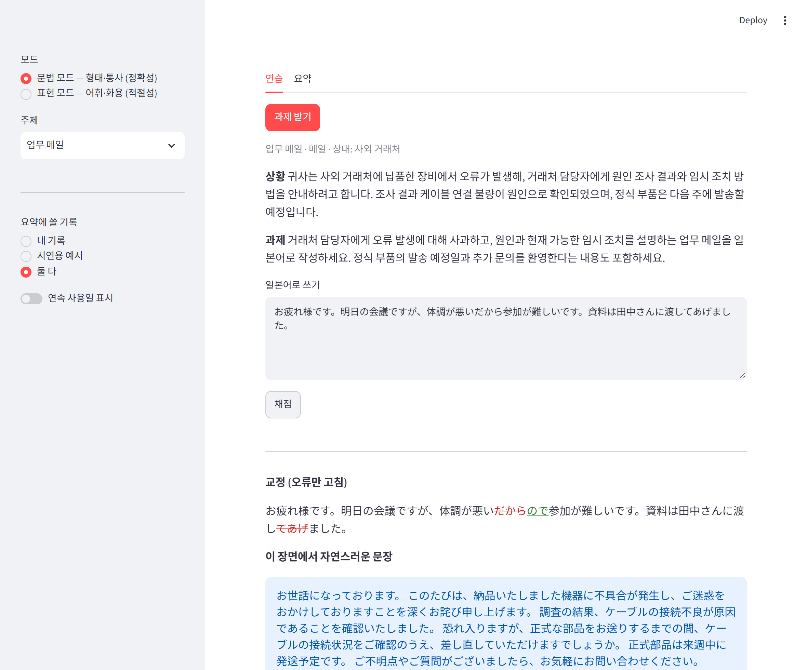
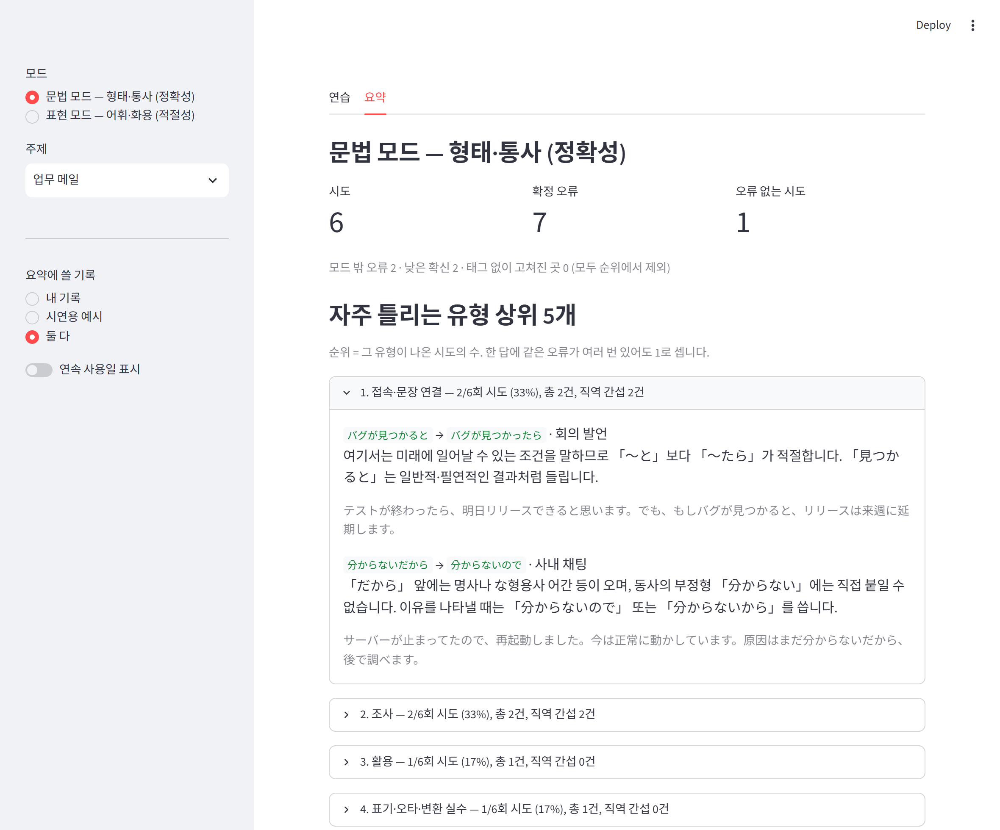

# PragmaticsKR2JP — a Japanese writing coach for Korean speakers

English · [한국어](README_kr.md) · [日本語](README_jp.md)

A personal, local app that tags errors in your Japanese writing against a **fixed error taxonomy**, then lets **code** — not the LLM — count which error types you repeat.



## Why

If you work in Japanese, you get by. But **nobody corrects you as long as the meaning comes through.**
Write `友達を合う` and your reader simply hears `友達に会う` and moves on. Speech recognition is worse: it quietly "fixes" a wrong particle into the phonetically closest right one, so the mistake never reaches you.
Years later you still use ほぼ / ほとんど / 大体 interchangeably, and Korean-shaped phrases (`ストレスを受ける`, `薬を食べる`) are still there.

One goal: **catch the wrong thing as the wrong thing** — and accumulate that into a number that says what you keep getting wrong.

## Design principles

### 1. The LLM is an annotator; code does the rest of the measurement

| LLM does | LLM never does | Code does |
|---|---|---|
| Generate tasks; tag error spans and types within a fixed taxonomy; write the correction and the Korean explanation | Scores, level judgments, totals, rankings, trends, checking its own output | Quote verification, silent-edit detection, majority voting, aggregation and ranking, measuring agreement and detection rate |

- We ask for categorical tags, never numeric scores: LLM judges are noisy on open numeric scales and steadier on concrete categorical calls.
- Still, each individual error call **is** an LLM measurement. "We aggregated deterministically, therefore it's objective" would be false. So the reliability (reproducibility) and validity (detection rate) of those annotations are measured and published below.
- By default, only records whose taxonomy, prompt, schema and model versions all match the current ones are aggregated. A sidebar toggle can include older records with the same taxonomy; the screen then shows the version mix. Different taxonomies are never mixed.

### 2. Don't get dragged

An LLM is the same kind of probabilistic model as speech recognition: it reads a wrong input as what you probably meant. Blocked with **code checks**, not polite requests in the prompt.

| | Check | What it prevents |
|---|---|---|
| A | Store the answer verbatim, no normalization | Errors disappearing at storage time |
| B | Separate "what you meant" from "what is wrong" in the output | Waving an error through because the meaning is clear |
| C | Separate the minimal correction from the natural rewrite; the correction on screen is **built by code from confirmed tags only** | Correction and polishing blurring together; unconfirmed edits leaking into the correction |
| D | **Verify each quoted span exists verbatim in the answer.** When the same string occurs several times (e.g. 「を」), code picks the position from context fields and the diff, and flags it if still ambiguous | Quoting an already-corrected form; two errors on repeated particles collapsing into one |
| E | **Verify every changed character is covered by some tag** | Silent corrections (surfaced as a warning) |
| E2 | **Detect two or more different words fixed inside one tag** (`友達を合って→友達に会って`) | One error buried inside another |
| F | Measure detection rate on an eval set with planted errors | Turning "it works well" into a number |

Overcorrection — the opposite failure — is measured too: how many tags land on answers that contain no errors. Width differences in punctuation, spaces, digits and Latin letters are never errors; half-width katakana (`ｻｰﾊﾞｰ→サーバー`) is a real orthography error and is kept.

Everything language-specific lives in [coach/lang_ja.py](coach/lang_ja.py), which exposes exactly two functions — `tokenize_chunks` (SudachiPy when installed, a script-based approximation otherwise) and `non_error_diff`. [coach/verify.py](coach/verify.py), voting and aggregation know nothing about Japanese.

### 3. Variance is handled by voting, not temperature

Each answer is graded 3 times. A finding counts as **confirmed** only if the same type overlapping the same span appears in at least 2 of the 3; single-run findings are shown as "low confidence" and excluded from the counts. The summary shows, next to each type, how many findings were unanimous and how many were dropped as low confidence. Code does the merging. There are no fixed few-shot answer examples (they skew topics and types) — only one short contrast pair per type, unrelated to any task.

### 4. Two modes: grammar and expression

Fewer types per decision means better agreement. Errors outside the chosen mode are tagged `OUT_OF_MODE` only and excluded from the ranking.

| Grammar mode (morphosyntax — accuracy) | Shared | Expression mode (lexis & pragmatics — appropriateness) |
|---|---|---|
| particles / conjugation / tense-aspect / voice & benefactives & transitivity / connectives | orthography, typos, IME conversion / other | politeness / register / sentence-final modality / collocation / word choice / discourse |

Every tag also carries a "Korean transfer" flag. Each task carries a medium (email / chat / spoken) and a relationship (client / manager / colleague / friend), and judgments are made for that scene.



## Reproducibility and detection experiment

**Method** ([experiments/repro.py](experiments/repro.py))
- Eval set: 12 answers with planted errors (6 grammar mode, 6 expression mode, 2 of them error-free), covering typical Korean-speaker mistakes (`友達を合う`, `薬を食べる`, `ストレスを受ける`, `勉強しました時` …) with the expected error spans.
- Three conditions, each graded 3 times: **plain** (type names only) / **guide** (full codebook prompt, single pass) / **vote** (codebook + 3-way majority).
- Model `gpt-5.6-terra`, reasoning effort low. One full run = 180 API calls. All metrics computed by code.

**Result 2 — p1 prompt, taxonomy v1** (`experiments/results/repro_20260920_032338.json`)

| Condition | Mode | Exact agreement | Jaccard | Span detection | Span + type | Tags on clean answers | Unexpected tags |
|---|---|---|---|---|---|---|---|
| plain | grammar | 0.67 | 0.83 | 1.00 | 0.29 | 0.00 | 0.60 |
| plain | expression | 0.17 | 0.67 | 0.93 | 0.67 | 2.33 | 0.80 |
| guide | grammar | 0.67 | 0.86 | **1.00** | 0.62 | 0.00 | 0.07 |
| guide | expression | 0.50 | 0.69 | 0.81 | 0.78 | 0.67 | 0.13 |
| vote | grammar | 0.67 | 0.85 | **1.00** | 0.58 | 0.00 | 0.07 |
| vote | expression | 0.67 | 0.82 | 0.74 | 0.67 | 1.00 | 0.20 |

Both tables predate the word-level E2 check and the narrowed width rule, which were generalized afterwards; those runs did not keep the raw model output, so they cannot be recomputed (later runs can, via `--rescore`). The earlier run (p0, taxonomy v0) is in `experiments/results/repro_20260920_031543.json`; see [README_kr.md](README_kr.md) for both tables and the full analysis.

**Current state:** the app now runs prompt p2 / schema s2 (position resolution for repeated quotes, code-built correction — [ADR 0009](docs/adr/0009-quote-resolution-version-filter.md)). A single live check passed, but the full p2 experiment is on hold until the eval set is rebuilt from real translations ([ADR 0007](docs/adr/0007-eval-set-from-user-translations.md)). The cost below is from p1; the p2 check cost about $0.04 per grading (context fields and more reasoning tokens).

**What the experiment changed**
1. Prompt rules were **not** reliably followed — "split merged tags" was obeyed once out of three times, "half-width `!?` is not an error" was mostly ignored. Both rules moved into code checks (E2 and the width filter). The project's own principle — block it in code, don't ask the model — is what the experiment supports.
2. It found two mistakes of ours: the taxonomy priority order was wrong (collocation errors were landing in word choice), and one gold label in the eval set was simply wrong.
3. A new drag path appeared: for `その→あの` the model left the minimal correction alone and silently fixed it only in the natural rewrite. Not yet blocked — see Next steps.

**Conclusions (12 items — a small sample)**
1. **Grammar mode does not get dragged**: in p1 both guide and vote found every planted error span (1.00); in p0, guide 0.96 and vote 1.00. Expression mode in p1 is plain 0.93 / guide 0.81 / vote 0.74 — lower than grammar mode, and lower the more guidance is added (apparently the price of fewer unexpected tags). Same direction as prior work reporting LLMs are strong on surface correction and weak on pragmatics.
2. **The codebook prompt clearly beats a plain instruction** (compared within one run, all items): in p1, plain → guide moves type accuracy 0.49 → 0.71, unexpected tags 0.70 → 0.10, tags on clean answers 1.17 → 0.33. p0 points the same way (0.49 → 0.67, 0.97 → 0.27, 1.33 → 0.50).
3. **3-way voting cannot be judged at this sample size.** A 0.1 difference is noise with 12 items. It is kept as the default because it attaches a confidence ("2 of 3") to every tag.
4. **Agreement is still low** (exact 0.5–0.67). Spans are stable; the type label wobbles at category boundaries.

**Limitations**
- The eval set was written by Claude and graded by GPT. Different models, but **not a human gold standard** — one label error was found this way. Native review is the cheapest next improvement.
- "Top 5" means "most frequent in the tasks you happened to get". Different topics elicit different errors.
- The eval set is still shaped by one illustrative example the author gave; see [ADR 0007](docs/adr/0007-eval-set-from-user-translations.md) for the plan to rebuild it from real translations.

## Cost

Computed from the actual token usage in the result files (`gpt-5.6-terra`: $2 in / $12 out per 1M tokens, 2026-09).

| Item | Calls | Cost |
|---|---|---|
| One grading call (~1,500 in / ~350 out+reasoning) | 1 | ~$0.007 |
| **One grading in the app** (3-way vote) | 3 | **~$0.02** |
| One task generation (`gpt-5.6-luna`) | 1 | <$0.001 |
| One full experiment | 180 | ~$1.2 |

## Running it

```powershell
python -m venv .venv
.venv\Scripts\python -m pip install -r requirements.txt
copy .env.example .env        # put in OPENAI_API_KEY (or GEMINI_API_KEY + LLM_PROVIDER=gemini)
.venv\Scripts\streamlit run app.py
```

- Practice tab: pick mode and topic in the sidebar → get a task → write in Japanese → grade.
- Summary tab: top 5 error types per mode with real examples. Choose demo samples (`samples/`), your own records (`data/`), or both.
- A streak counter can be switched on in the sidebar (off by default). No quotas, no target scores.
- The bundled demo samples were produced with prompt p1. Under the default strict version filter they are hidden; switch on **"이전 버전 기록도 포함"** (include older records) in the sidebar to see them.

```powershell
.venv\Scripts\python -m pytest -q                    # code checks, voting, aggregation (no API)
.venv\Scripts\python -m experiments.repro            # experiment (~180 API calls)
.venv\Scripts\python -m experiments.build_samples    # regenerate demo samples
.venv\Scripts\python -m tools.screenshots            # regenerate README screenshots
```

## Layout

```
app.py                  Streamlit UI
coach/taxonomy.py       error taxonomy v1 (order = priority)
coach/prompts.py        task and grading prompts
coach/llm.py            the only place that calls an LLM
coach/verify.py         anti-drag checks D, E, E2 (language-agnostic)
coach/lang_ja.py        Japanese layer: word chunking, non-error differences
coach/voting.py         3-way majority voting
coach/stats.py          aggregation (pure functions)
experiments/            eval set, experiment script, results (raw model output kept)
docs/adr/               architecture decision records
samples/                demo samples, synthetic (committed)
data/                   your own records, JSONL, append-only (git-ignored)
```

## Next steps

- Surface edits the model makes only in the natural rewrite (e.g. `その→あの`)
- Rebuild the eval set from the user's real translations, labeled typo vs. misconception, reviewed by a native speaker, 30+ items ([ADR 0007](docs/adr/0007-eval-set-from-user-translations.md))
- Dynamic few-shot: retrieve past cases of the same error type once records accumulate
- Out of scope for now: speech input, scheduled tests, spaced repetition, more charts, login, deployment
  - Speech input only makes sense with recognition that does not language-model-correct the learner's mistakes away

## License

MIT
